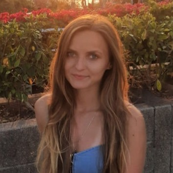

# Katsiaryna Razhkova



## Contacts
phone: +375(29)225-13-20  
email: katetigar@gmail.com

***

## About yourself
Motivated and determined!  
Fast-learner and team player.  
All time I enjoy learning something new (By the way: Do you know that cows moo with regional accents?). 

Want to become a web-developer.

## Skills
* **HTML** - beginner 
* **CSS**  - beginner
* **JS**   - beginner
* **Git**  - beginner

## Code example
``` 
function multiply(a, b){
  return a * b
}
```
## Experience
[RS School CV Project](https://github.com/kate-rzk/rsschool-cv)

## Education
**Belarusian state academy of communications**  
* Bachelor degree:  
Faculty of engineering and communication technologies 
* Master degree:  
Faculty of telecommunications, specialty - public administration.

## Languages
* Belarussian - Native
* Russian - Native
* English -  A2
